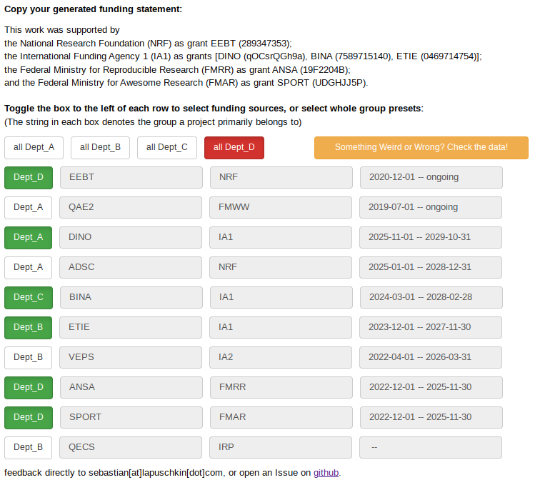

# Funding Statement Generator
Pretty much every research paper (partly) funded by, or published in the context of third party research project needs a correct funding statement in the acknowledgements section to count as a contribution to said project. However, with the number of projects funding individual authors of my research group, there usually are very few individuals having a complete overview over all the for the publication relevant funding sources, including all the required detail to issue a proper and correct funding statement.

## Objective of the Funding Statement Generator.
The first objective of this tool is to provide an easy to use and reliable way to generate correct, compact and complete funding statement, by just clicking some buttons.

<div align="center">

<p>
The Funding Statement Generator, compiling a funding statement for an Acknowledgements section based on fictional project data from <a href="./projects.csv">projects.csv</a>
</div>

## Implementation Details.

The tool implemented within this project is built upon `bokeh 2.3.3` for hosting interactive web interfaces fed via python backends. It basically reads all available data held in a `csv` table, which can be kept up to date by the project managers with access to this project, and provides a some buttons to (de)select projects to generate a funding statement for.

## Installation.

It is recommended to create a virtual conda environment first, to avoid version conflicts with other python-based projects, eg

```
# create env
conda create -n funding-statement-generator Python=3

# activate the env
conda activate funding-statement-generator

# install requirements via pip
pip install -r requirements.txt

# run the project (and then navigate to the URL written to the CLI)

bokeh serve main.py
```

For convenience, I have set up a cron job on my workstation, which executes the `run_infinite.sh` script on startup. `run_infinite` just immediately re-starts `run.sh` should a crash occur to guarantee a near 100% up-time of the tool.

The file `run.sh` in turn loads up the virtual python environment, configures the accessibility end points via which the funding statement generator is reachable, and runs the script. Configure your allowed ports and host names here.


## Maintaining the project data

Next to the implementation in `main.py`, the project data in `projects.csv` constitutes the heart of this tool. Each line of the `csv` table contains `;` (semicolon) - separated entries describing in the following order

- `GROUP`: The primary group funded by this project. This is used to implement eg "select all projects from research group" functionality, and provide lables for the clickable selector buttons. Group buttons are populated automatically, based on the provided data.
- `P_NAME`: The project short name
- `P_NO`: The project number
- `P_TYPE`: Type of project, eg most commonly "grant" or "research unit"
- `P_LONGNAME`: The project long name
- `FA_NAME`: The project's funding agency short name
- `FA_LONGNAME`: The project's funding agency long name
- `P_START`: The project start date in format `YYYY-MM-DD`
- `P_END`: The project end date in format `YYYY-MM-DD`
- `P_HIDDEN` : whether to hide this (potentially legacy and non-public) project in the UI. Every non-empty string in this field counts as `TRUE`, therefore use it as comments.

eg, the table follows the format, where during IO trailing and leading whitespaces will be stripped
```
GROUP   ;   P_NAME  ;   P_NO    ;  P_TYPE   ;   P_LONGNAME  ;   FA_NAME ;   FA_LONGNAME ;   P_START ;   P_END   ;   P_HIDDEN
Dept_A  ;   DINO    ;   qOCsrQGh9a   ;   grant   ;   Dynamic Intelligent Network Optimization ;   IA1   ;   International Funding Agency 1   ;   2025-11-01  ;   2029-10-31  ;
Dept_B  ;   QECS  ;   LOLWHAT 60-19415    ;   grant   ; Quantum-Empowered Computing Systems ;   IRP  ;   Internal Research Programs    ;    ;  ;
Dept_A  ;   ADSC   ;   FRMNY 3303   ;   research unit   ;   Adaptive Data Security for Smart Cities    ;   NRF ;   National Research Foundation  ;   2025-01-01  ;   2028-12-31  ;
Dept_C  ;   BINA ;   7589715140   ;   grant   ;   Bio-inspired Neural Augmentation  ;   IA1   ;   International Funding Agency 1 ;   2024-03-01  ;   2028-02-28    ;
Dept_B  ;   ETIE    ;   0469714754   ;   grant   ;   Efficient Transmission in IoT Environments   ;   IA1   ;   International Funding Agency 1   ;   2023-12-01  ;   2027-11-30  ;
Dept_B  ;   VEPS  ;   VCCEM2PI  ;   grant   ;   Virtualized Edge Processing Solutions  ;   IA2 ;   International Funding Agency 2 ;   2022-04-01  ;   2026-03-31  ;
Dept_D  ;   HACAT    ;   ;   research unit   ;   Human-AI Collaborative Analysis Tools    ;   ;   ;   2024-07-01  ;   2026-01-31  ;   non_public
[...]

```

Note that, as per linux/unix convention, we will end the file with an empty trailing line.

The generator automatically handles missing project information in the generated output.


